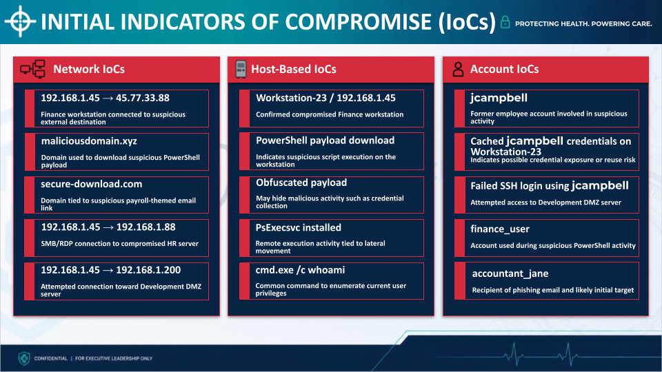
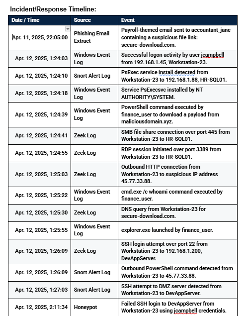

# 🛡️ Incident Response & Threat Investigation Capstone


**Author:** Ryan Coyle  
**Project Role:** Incident Response Team Member — Simulated Capstone Engagement  
**Career Focus:** SOC Analyst / Junior Security Analyst  
**LinkedIn:** https://www.linkedin.com/in/rc770077  
**GitHub:** https://github.com/rc7700-77  
**Email:** ryancoyle7@gmail.com

---

## 📌 Project Overview

This project documents a fictional incident response investigation involving **HealthSecure Systems (HSS)**, a regional healthcare software provider.

The scenario involved a phishing-driven compromise of a Finance workstation. I analyzed multiple security evidence sources to reconstruct the attack timeline, identify Indicators of Compromise (IoCs), determine the scope of affected systems, evaluate lateral movement activity, and develop containment, eradication, recovery, and long-term security improvement strategies.

The investigation required correlating endpoint, network, authentication, IDS, phishing, honeypot, and forensic evidence rather than relying on a centralized SIEM.

---

## 🧪 Scenario and Timeline Note

This project was completed as a **fictional incident-response capstone**.

The initial incident activity was analyzed from scenario-provided evidence, including Windows Event Logs, Zeek logs, Snort alerts, phishing-email evidence, asset data, honeypot activity, and forensic updates.

Response actions and post-containment timestamps in the final report represent the **simulated response strategy developed for the capstone**. The 0–6 hour and 6–24 hour response windows were planning targets, and response phases may overlap based on operational priority.

HealthSecure Systems, its users, systems, accounts, IP addresses, incident data, and business information are fictional and are presented solely for educational and professional portfolio purposes.

---

## 🎯 Primary Investigation Outcomes

- Identified a **payroll-themed phishing email** as the initial attack vector.
- Confirmed compromise of **Workstation-23 (192.168.1.45)**.
- Treated **HR-SQL01 (192.168.1.88)** as compromised based on corroborating PsExec, SMB, and RDP activity.
- Identified **DevAppServer (192.168.1.200)** as targeted through SSH activity, but did not classify it as compromised because successful access was not confirmed.
- Identified suspicious credential activity involving the former employee account `jcampbell`.
- Correlated PowerShell, PsExec, SMB, RDP, HTTP, DNS, and SSH activity across multiple log sources.
- Determined that **no confirmed evidence showed payroll, PII, or development data was accessed, altered, or exfiltrated**.
- Classified the incident as **High severity (P2)**.
- Developed a structured containment, eradication, recovery, monitoring, and long-term improvement strategy.

---

## 🖥️ Incident Scope

| Asset | Role | Assessment |
|---|---|---|
| **Workstation-23** — `192.168.1.45` | Finance workstation | **Confirmed compromised** |
| **HR-SQL01** — `192.168.1.88` | HR database server containing payroll/PII resources | **Treated as compromised** |
| **DevAppServer** — `192.168.1.200` | Development DMZ server | **Targeted; compromise not confirmed** |

The distinction between **confirmed compromise**, **systems treated as compromised based on corroborating evidence**, and **attempted access** was important to avoid overstating the available evidence.

---

## ⏱️ Attack Timeline Summary

The investigation reconstructed the following attack progression:

1. A payroll-themed phishing email was delivered to a Finance user.
2. Suspicious authentication activity involving former employee credentials appeared on Workstation-23.
3. PsExec activity was detected during the incident window.
4. PowerShell executed a command that downloaded a suspicious payload.
5. Workstation-23 established SMB and RDP connections with HR-SQL01.
6. The compromised workstation communicated with a suspicious external destination.
7. Additional DNS and outbound activity was observed.
8. SSH activity was directed toward DevAppServer in the Development DMZ.
9. The honeypot recorded a failed SSH login using `jcampbell` credentials.

This required correlating events from several independent security data sources into a single incident narrative.

---

## 📂 Evidence Sources Analyzed

The investigation used scenario-provided evidence from:

- **Windows Event Logs**
- **Snort IDS alerts**
- **Zeek network logs**
- **Phishing email extract**
- **Asset inventory**
- **Bitdefender EDR information**
- **Development DMZ honeypot**
- **IT forensic investigation updates**
- **Internal incident-response preparedness memo**

Because HSS did not have a centralized SIEM, evidence had to be correlated manually across multiple sources.

---

## 🔎 Indicators of Compromise

IoCs were organized into three categories.

### Network Indicators

- Suspicious outbound traffic from Workstation-23
- Communication with an external suspicious IP address
- Malicious or suspicious domains associated with the phishing and payload activity
- SMB/RDP communication from Workstation-23 to HR-SQL01
- SSH activity from Workstation-23 toward DevAppServer

### Host-Based Indicators

- Suspicious PowerShell payload download
- Obfuscated PowerShell activity
- PsExec service installation
- `cmd.exe /c whoami`
- Workstation-23 as the primary compromised endpoint

### Account Indicators

- `jcampbell` — former employee account involved in suspicious activity
- Cached `jcampbell` credentials on Workstation-23
- Failed SSH authentication using `jcampbell`
- `finance_user` associated with suspicious PowerShell execution
- `accountant_jane` as the phishing recipient and likely initial target

---

## 🧩 Evidence Correlation

A major part of this project involved determining what conclusions could and could not be supported by the available evidence.

For example:

- **Workstation-23** showed direct evidence of suspicious PowerShell execution, outbound communication, PsExec-related activity, and internal movement.
- **HR-SQL01** was treated as compromised because multiple sources showed activity directed toward it, including PsExec, SMB, and RDP.
- **DevAppServer** received SSH attempts, including a failed login captured by the honeypot, but there was no evidence of successful access.
- Suspicious outbound traffic could indicate command-and-control behavior, but there was **insufficient evidence to claim data exfiltration**.

This distinction helped prevent unsupported conclusions and kept the incident scope tied to observable evidence.

---

## 🚨 Incident Response Strategy

### Containment

The response strategy included:

- Isolating the compromised Finance workstation
- Blocking known malicious IP addresses and domains
- Disabling or restricting risky accounts
- Preserving forensic evidence before cleanup
- Restricting SMB, RDP, and SSH access to sensitive systems
- Applying temporary access controls around HR and Development resources
- Monitoring Snort and Zeek activity for repeat connections
- Coordinating with Legal and Compliance because payroll and PII resources were potentially at risk

### Eradication

The eradication plan addressed:

- Malicious PowerShell activity
- Suspicious payload artifacts
- PsExec service activity
- Exposed or stale credentials
- Former employee accounts
- Weak SMB/RDP/SSH access controls
- Endpoint visibility gaps
- Missing or inconsistent security logging
- Required system patching and security configuration changes

### Recovery

The recovery strategy included:

- Rebuilding or fully cleaning Workstation-23 before reuse
- Validating HR-SQL01 before restoring normal access
- Reviewing DevAppServer because it had been targeted
- Comparing affected systems against trusted backups and known-good records
- Testing restored systems for both functionality and security
- Restoring services in deliberate phases
- Enforcing MFA on sensitive accounts
- Beginning enhanced post-incident monitoring
- Maintaining focused monitoring of known IoCs for 30 days

---

## ⚠️ Security Gaps Identified

The investigation highlighted several organizational weaknesses that increased incident risk or complicated the response.

| Security Gap | Risk |
|---|---|
| **Manual employee offboarding** | Former employee accounts and credentials could remain usable |
| **No centralized SIEM** | Analysts must manually correlate multiple independent log sources |
| **Incomplete PowerShell logging** | Reduced visibility into malicious scripting activity |
| **EDR / endpoint visibility gaps** | Critical Linux and DMZ systems may not generate consistent detection telemetry |
| **Weak internal access controls** | A compromised endpoint could communicate with sensitive systems through SMB, RDP, or SSH |
| **Limited phishing preparedness** | Employees may be less prepared to identify targeted phishing attempts |
| **Limited tabletop exercises** | The IR team has fewer opportunities to practice coordinated response procedures |

---

## ✅ What Worked Well

The investigation also identified defensive capabilities that provided valuable visibility.

- Snort detected suspicious activity and possible lateral movement.
- Zeek provided visibility into network connections between Workstation-23 and sensitive systems.
- Windows Event Logs revealed PowerShell, PsExec, authentication, and command activity.
- The Development DMZ honeypot identified unauthorized SSH activity.
- Existing network segmentation provided a starting point for limiting movement between business environments.
- Multiple evidence sources allowed suspicious activity to be independently corroborated.

Identifying both **security failures and functioning controls** helped produce a more balanced assessment of HSS's defensive posture.

---

## 🛠️ Long-Term Security Recommendations

The final response recommended several improvements:

### Identity and Access Management
- Automate employee offboarding
- Immediately disable accounts when employees leave
- Perform recurring access reviews
- Reduce unnecessary privileges and stale credentials
- Enforce MFA for sensitive and administrative accounts

### Detection and Monitoring
- Implement a centralized **SIEM or centralized log-analysis process**
- Standardize EDR policies across Windows, Linux, and DMZ systems
- Enable PowerShell logging across all Windows endpoints
- Improve authentication and lateral-movement monitoring

### Network Security
- Strengthen segmentation between Finance, HR, Development, and administrative environments
- Restrict SMB, RDP, and SSH to approved users, systems, and business workflows

### Email and User Security
- Improve phishing detection and email security controls
- Conduct recurring phishing simulations
- Provide role-specific security awareness training

### Incident Response Preparedness
- Update the IR playbook for phishing, credential misuse, PowerShell abuse, and lateral movement
- Conduct quarterly tabletop exercises
- Define clear response roles, escalation procedures, evidence requirements, and communication expectations

---

## 👁️ SOC Analyst Skills Demonstrated

| SOC / IR Skill | Project Evidence |
|---|---|
| **Alert triage** | Reviewed and correlated Snort, Windows, Zeek, honeypot, and forensic evidence |
| **Log analysis** | Reconstructed activity across endpoint, network, authentication, DNS, HTTP, SMB, RDP, and SSH events |
| **IoC identification** | Categorized network, host-based, and account indicators |
| **Incident timeline reconstruction** | Correlated events from phishing through attempted lateral movement |
| **Incident scoping** | Distinguished confirmed compromise, systems treated as compromised, and targeted systems |
| **Lateral movement analysis** | Investigated PsExec, SMB, RDP, and SSH activity |
| **Evidence-based reasoning** | Avoided claiming successful DevAppServer compromise or data exfiltration without supporting evidence |
| **Containment planning** | Developed endpoint isolation, indicator blocking, account restrictions, and network controls |
| **Eradication and recovery** | Developed cleanup, rebuild, validation, phased restoration, and monitoring procedures |
| **Detection & monitoring improvement** | Identified SIEM, EDR, PowerShell logging, and monitoring improvements |
| **Business communication** | Translated technical findings into executive-level risk and remediation recommendations |
| **Continuous improvement** | Recommended offboarding automation, segmentation, training, and tabletop exercises |

---

## 📸 Evidence Highlights

| Evidence | Demonstrated Skill |
|---|---|
| [`01-scope-and-key-metrics.png`](evidence/01-scope-and-key-metrics.png) | Incident scoping and impact assessment |
| [`02-ioc-analysis.png`](evidence/02-ioc-analysis.png) | Network, host, and account IoC analysis |
| [`03-incident-timeline.png`](evidence/03-incident-timeline.png) | Multi-source event correlation and attack reconstruction |
| [`04-ir-response-plan.png`](evidence/04-ir-response-plan.png) | Incident response lifecycle planning |
| [`05-response-strategy.png`](evidence/05-response-strategy.png) | Containment, eradication, and recovery strategy |
| [`06-lessons-and-improvements.png`](evidence/06-lessons-and-improvements.png) | Lessons learned and long-term security improvements |

### IoC Analysis



### Incident Timeline



---

## 📄 Project Deliverables

### Final Incident Response Report

The full technical report documents:

- Executive summary
- Preparation and readiness assessment
- Detection and identification
- Indicators of Compromise
- Log and alert analysis
- Incident scope
- Severity assessment
- Containment
- Eradication
- Recovery
- Post-recovery monitoring
- Lessons learned
- Continuous improvement
- Incident timeline

➡️ [View the Incident Response Report](docs/Incident_Response_Report.pdf)

### Executive Briefing

The executive briefing translates the technical investigation into a concise leadership-level presentation covering:

- Breach summary
- Potential business impacts
- Known evidence
- Key metrics
- IoCs
- Incident response lifecycle
- Containment, eradication, and recovery strategy
- Lessons learned
- Long-term security improvements

➡️ [View the Incident Response Executive Briefing](docs/Incident_Response_Executive_Briefing.pdf)

---

## 📁 Repository Structure

```text
incident-response-capstone/
│
├── docs/
│   ├── Incident_Response_Report.pdf
│   └── Incident_Response_Executive_Briefing.pdf
│
├── evidence/
│   ├── 01-scope-and-key-metrics.png
│   ├── 02-ioc-analysis.png
│   ├── 03-incident-timeline.png
│   ├── 04-ir-response-plan.png
│   ├── 05-response-strategy.png
│   └── 06-lessons-and-improvements.png
│
├── .gitignore
└── README.md
```

---

## ⚠️ Project Limitations

This project represents an educational incident response investigation conducted using a **fictional security breach scenario and a predefined set of simulated evidence**.

The investigation was limited to the logs, alerts, phishing evidence, asset information, honeypot activity, and forensic updates supplied as part of the scenario. It did not include access to live production systems, full disk or memory images, packet captures, cloud telemetry, a centralized SIEM, or additional evidence that may be available during a real enterprise investigation.

As a result, conclusions were intentionally limited to what the available evidence could support. For example, DevAppServer was identified as targeted but not confirmed compromised, and suspicious outbound communication was not treated as proof of data exfiltration.

Response actions and post-containment timestamps documented in the final report represent the simulated incident response strategy developed for the capstone.

---

## ⚖️ Ethical Use and Disclaimer

This repository documents a **fictional cybersecurity capstone scenario**.

HealthSecure Systems is a fictional organization. All employees, accounts, systems, IP addresses, incident records, business information, and security events presented in this repository are simulated for educational purposes.

No real organization, production system, patient information, employee information, or proprietary business data was involved.

---

## 🏁 Project Outcome

The investigation demonstrated how a phishing-based compromise of a Finance workstation developed into suspicious former-employee credential activity, PsExec activity, PowerShell payload download, and lateral movement toward sensitive HR and Development systems.

The project required correlating multiple independent evidence sources to reconstruct the incident and distinguish between confirmed compromise, systems treated as compromised based on corroborating evidence, and unsuccessful access attempts.

```text
Initial Phishing
      ↓
Workstation-23 Compromise
      ↓
Former-Employee Credential Activity
      ↓
PsExec Activity
      ↓
PowerShell Payload Download
      ↓
SMB / RDP Activity to HR-SQL01
      ↓
HR-SQL01 Treated as Compromised
      ↓
SSH Targeting of DevAppServer
      ↓
Failed jcampbell SSH Attempt
      ↓
Containment & Investigation
```

---

## 💡 Key Takeaways

This project strengthened my ability to move from isolated alerts and logs to a defensible incident narrative.

The most important lessons were:

- Security events should be correlated across multiple telemetry sources before conclusions are made.
- A connection or failed authentication attempt does not automatically prove successful compromise.
- Suspicious outbound traffic does not automatically prove data exfiltration.
- Identity lifecycle failures can create security risk long after an employee leaves.
- Centralized and correlated telemetry can improve investigation visibility and efficiency.
- Incident response requires both technical investigation and clear communication of business impact.
- Containment, eradication, and recovery should be performed deliberately while preserving evidence and maintaining business continuity.

---

## 📬 Contact

**Ryan Coyle**

LinkedIn: https://www.linkedin.com/in/rc770077  
GitHub: https://github.com/rc7700-77  
Email: ryancoyle7@gmail.com
